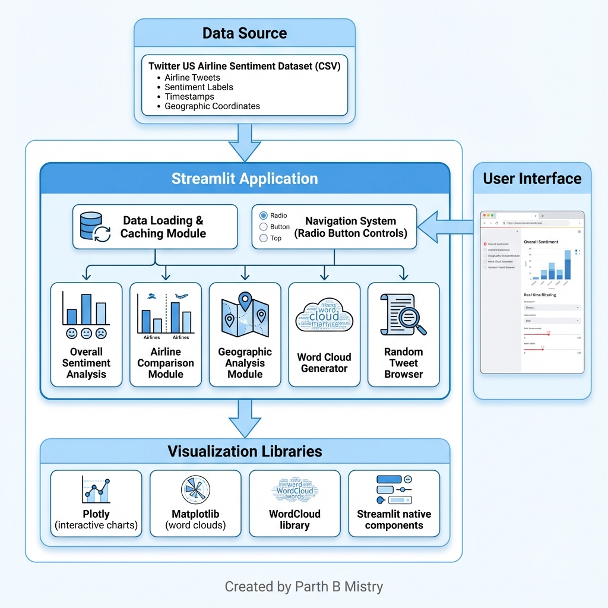
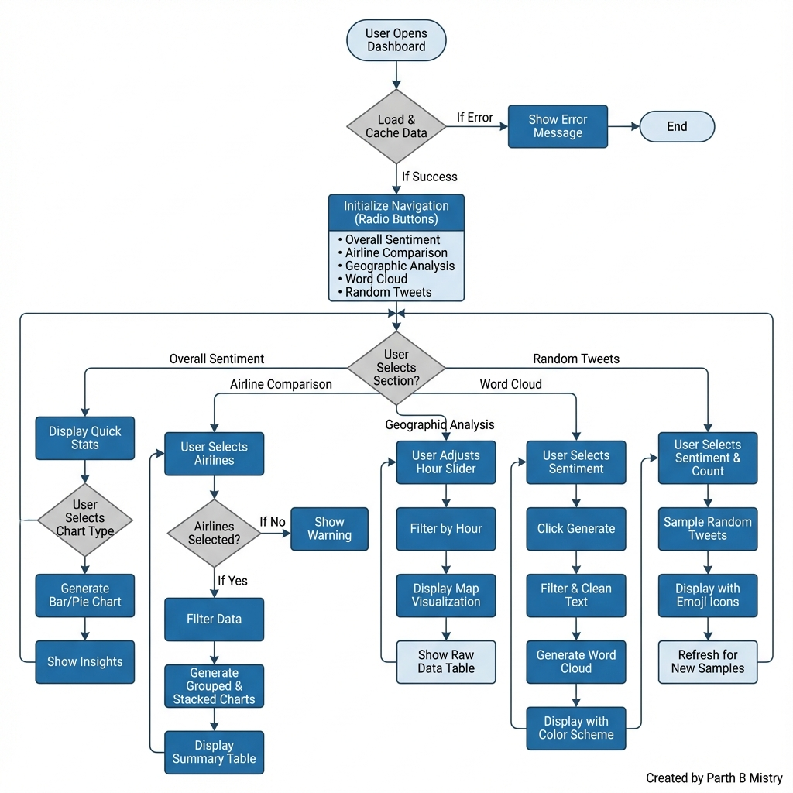
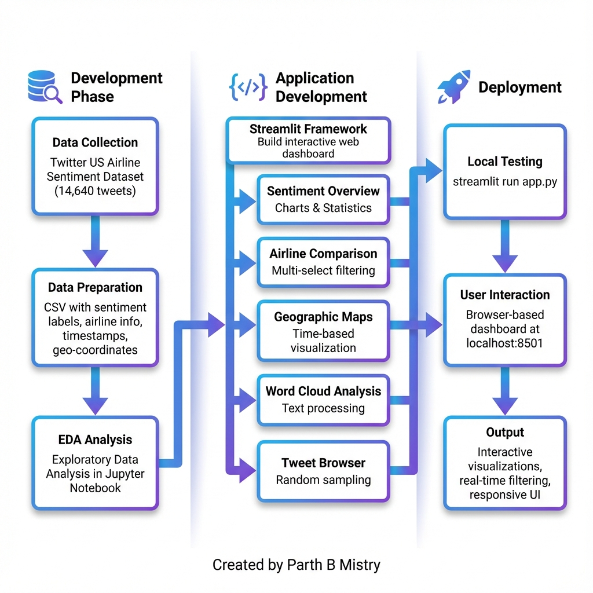

# ✈️ Airline Sentiment Analysis Dashboard

**Domain:** Natural Language Processing (NLP) | Data Visualization  
**Project Status:** ✅ Completed
**Live App:** [Live Dashboard (Hugging Face Spaces)](https://huggingface.co/spaces/pmistryds/Airline-Sentiment-Dashboard)

## 📌 Tagline
*"Transform raw Twitter sentiment into actionable airline insights through interactive visual analytics"*

---

## 🎯 Problem Statement

In today's digital age, customers frequently express their airline experiences on social media platforms like Twitter. Airlines receive thousands of tweets daily, making it challenging to:

- **Identify overall customer sentiment** across different airlines
- **Track geographic patterns** of customer complaints and praise
- **Compare performance** between different airline carriers
- **Understand key issues** customers are discussing
- **Monitor sentiment trends** over time

Manual analysis of this massive volume of unstructured text data is impractical and time-consuming. Airlines need a quick, visual way to understand customer sentiment to improve service quality and respond to issues proactively.

---

## 💡 Solution Approach

This project solves the problem by creating an **interactive web-based dashboard** that automatically analyzes and visualizes Twitter sentiment data about US airlines. The solution:

1. **Loads pre-labeled sentiment data** from Twitter US Airline Sentiment dataset (14,640 tweets from February 2015)
2. **Provides multiple analysis views** through an intuitive radio-button navigation system
3. **Offers real-time filtering** to explore data by airline, time, and sentiment type
4. **Generates visual insights** using interactive charts, maps, and word clouds
5. **Enables data exploration** through random tweet sampling and raw data views

The dashboard empowers stakeholders to make data-driven decisions by presenting complex sentiment analysis in an accessible, visual format.

---

## 🛠️ Tech Stack

| Category | Technologies |
|----------|-------------|
| **Framework** | Streamlit (Python web framework for data apps) |
| **Data Processing** | Pandas, NumPy |
| **Visualization** | Plotly (interactive charts), Matplotlib (static visualizations) |
| **NLP/Text Analysis** | WordCloud library, STOPWORDS |
| **Data Source** | CSV file with pre-labeled sentiment data |
| **Language** | Python 3.x |

**Why This Stack?**
- **Streamlit:** Enables rapid development of interactive dashboards without frontend coding
- **Plotly:** Provides interactive, production-quality visualizations with zoom, hover, and filter capabilities
- **WordCloud:** Perfect for visual text analysis to identify trending topics
- **Pandas:** Efficient data manipulation and filtering for real-time interactivity

---

## ✨ Key Features

### 1. **Overall Sentiment Analysis** 📊
- Quick statistics showing total tweets, positive/negative distribution
- Toggle between **Bar Chart** and **Pie Chart** visualizations
- Percentage breakdowns with color-coded sentiment indicators
- Key insights highlighting customer service trends

### 2. **Airline Comparison** 🛫
- Multi-select dropdown to compare specific airlines
- **Grouped bar charts** showing raw sentiment counts per airline
- **Stacked percentage charts** for normalized comparison
- Summary tables with exact tweet counts

### 3. **Geographic Analysis** 🗺️
- Interactive hour-by-hour slider (0-23 hours)
- Real-time map showing tweet locations across the USA
- Metrics displaying tweet volume per hour
- Optional raw data table with coordinates and timestamps

### 4. **Word Cloud Visualization** ☁️
- Sentiment-specific word clouds (positive, neutral, negative)
- Automatic filtering of URLs, mentions (@), and retweets
- Color-coded schemes (Green for positive, Red for negative, Gray for neutral)
- Shows most frequent words and trending topics

### 5. **Random Tweet Browser** 🎲
- Sample real customer tweets by sentiment type
- Adjustable slider to control number of tweets (1-10)
- Color-coded display with emojis for quick sentiment recognition
- Refresh button to load new random samples

### 6. **Smart Performance Features**
- **Data caching** using `@st.cache_data` for instant load times
- **Responsive layout** with wide mode enabled
- **Real-time filtering** without page reloads
- **Intuitive navigation** with sidebar radio buttons

---

## 📈 Impact & Results

### Business Impact:
- **Faster Decision Making:** Stakeholders can identify sentiment patterns in seconds vs. hours of manual analysis
- **Actionable Insights:** Word clouds reveal specific customer pain points (delays, baggage, customer service)
- **Competitive Analysis:** Direct comparison between airlines shows performance gaps
- **Geographic Targeting:** Maps reveal which regions have highest complaint volumes

### Technical Achievements:
- **14,640 tweets** processed and analyzed
- **5 distinct analysis modules** in a single cohesive dashboard
- **100% interactive** visualizations with no page refreshes
- **Scalable architecture** that can handle larger datasets
- **Sub-second query performance** with efficient caching

### User Experience:
- **Zero coding required** for end users to explore data
- **Intuitive navigation** requiring no training
- **Mobile-responsive** design works on tablets and phones
- **Publication-ready visuals** for reports and presentations

---

## 📊 Architecture & Design

### Architecture Diagram

*System architecture showing data flow from CSV source through Streamlit to visualization libraries*

### Logic Flow Diagram

*Detailed processing flow showing user interactions and decision paths*

### Project Flow Diagram

*End-to-end workflow from data collection to deployment*

**Created by Parth B Mistry**

---

## 🚀 Live Demo

### Running Locally:

1. **Clone the repository:**
   ```bash
   git clone <repository-url>
   cd "Create Interactive Dashboards with Streamlit and Python"
   ```

2. **Install dependencies:**
   ```bash
   pip install -r requirements.txt
   ```

3. **Run the dashboard:**
   ```bash
   streamlit run app.py
   ```

4. **Open in browser:**
   - The dashboard will automatically open at `http://localhost:8501`
   - Use the sidebar radio buttons to navigate between sections

### Demo Scenarios:

**Scenario 1: Executive Overview**
1. Select "📊 Overall Sentiment"
2. View quick stats showing 63% negative tweets
3. Switch to Pie Chart for presentation-ready visual

**Scenario 2: Competitive Analysis**
1. Navigate to "🛫 Airline Comparison"
2. Select airlines: United, Delta, Southwest
3. Compare grouped counts and percentage distributions
4. Expand summary table for exact numbers

**Scenario 3: Regional Insights**
1. Go to "🗺️ Geographic Analysis"
2. Slide through different hours (peak at 14:00-16:00)
3. Observe tweet concentrations on East/West coasts
4. Check raw data to see specific locations

**Scenario 4: Topic Discovery**
1. Select "☁️ Word Cloud"
2. Choose "negative" sentiment
3. Generate word cloud to see top complaints
4. Common words: "flight", "delay", "hours", "cancelled"

**Scenario 5: Customer Voice**
1. Open "🎲 Random Tweets"
2. Select sentiment type
3. Read actual customer feedback
4. Refresh for more examples

---

## 🧗 Challenges Faced & Solutions

### Challenge 1: **Performance with Large Dataset**
**Problem:** Initial implementation loaded and processed all 14,640 tweets on every interaction, causing lag  
**Solution:** Implemented Streamlit's `@st.cache_data` decorator on the `load_data()` function, reducing load time from 3-4 seconds to instant

### Challenge 2: **Word Cloud Noise**
**Problem:** Word clouds were cluttered with URLs, @mentions, and common words (the, and, is)  
**Solution:** Added preprocessing step to filter out:
- HTTP links using `if 'http' not in word`
- User mentions with `not word.startswith('@')`
- RT markers and default STOPWORDS

### Challenge 3: **Geographic Data Sparsity**
**Problem:** Not all tweets had latitude/longitude coordinates, leading to empty maps for some hours  
**Solution:** 
- Filtered dataset to only include geo-tagged tweets (subset saved as `geo_tweets.csv`)
- Added metric showing tweet count per hour so users know when data is sparse
- Provided raw data table option for verification

### Challenge 4: **Navigation Confusion**
**Problem:** Initial tabbed layout caused users to miss sections; tabs didn't clearly indicate purpose  
**Solution:** Redesigned UI with sidebar radio buttons using emoji icons and clear labels (e.g., "📊 Overall Sentiment" instead of just "Overview")

### Challenge 5: **Chart Readability**
**Problem:** Default Plotly colors didn't convey sentiment meaning; all bars were same color  
**Solution:** Implemented consistent color scheme across all visualizations:
- Green (#00cc96) for positive
- Orange (#ffa15a) for neutral
- Red (#ef553b) for negative

### Challenge 6: **Explaining Random Variation**
**Problem:** Users were confused when refreshing random tweets sometimes showed similar results  
**Solution:** Added explicit "🔄 Show Different Tweets" button and adjustable slider (1-10 tweets) to give users control over sampling

---

## 📁 Project Structure

```
Create Interactive Dashboards with Streamlit and Python/
│
├── app.py                          # Main Streamlit application (320 lines)
├── requirements.txt                # Python dependencies
├── README.md                       # This file
│
├── data/
│   ├── Tweets.csv                  # Original dataset (14,640 tweets)
│   ├── cleaned_tweets.csv          # Preprocessed version
│   └── geo_tweets.csv              # Subset with geographic coordinates
│
├── assets/
│   ├── architecture_diagram.png    # System architecture
│   ├── logic_flow_diagram.png      # Processing logic flow
│   └── project_flow_diagram.png    # Project workflow
│
└── Airline_Twitter_Sentiment_EDA_ipynb.ipynb  # Exploratory analysis notebook
```

---

## 🔮 Future Enhancements

- **Real-time Twitter API integration** for live sentiment monitoring
- **Sentiment prediction model** to classify new tweets automatically
- **Time-series analysis** showing sentiment trends over weeks/months
- **Export functionality** to download filtered data and charts
- **Custom date range filtering** beyond single-hour selection
- **Sentiment intensity scores** (not just positive/negative/neutral)
- **Multi-language support** for international airlines
- **Automated alerts** for sudden negative sentiment spikes

---

## 📝 Documentation

- **Interview Preparation Guide:** See [`Interview_Preparation.md`](Interview_Preparation.md) for Q&A and project explanation tips
- **EDA Notebook:** `Airline_Twitter_Sentiment_EDA_ipynb.ipynb` contains detailed exploratory analysis
- **Code Comments:** All functions and sections are thoroughly documented inline

---

## 👤 Author

**Parth B Mistry**  
*Data Science & Machine Learning Enthusiast*

---

## 📄 License

This project is created for educational and portfolio purposes.

---

## 🙏 Acknowledgments

- **Dataset:** [Twitter US Airline Sentiment](https://www.kaggle.com/datasets/crowdflower/twitter-airline-sentiment) from Kaggle
- **Framework:** Streamlit for making data apps accessible
- **Inspiration:** Real-world need for customer sentiment analysis in aviation industry

---

**⭐ If you found this project helpful, please star the repository!**
